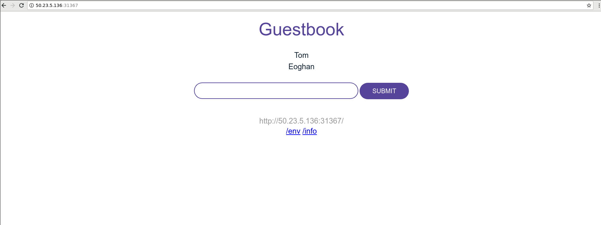

# Lab 1. I just want to deploy!

We developers are a lazy bunch! If we can get away with just typing a single command over multiple, not worrying about how things tie together, then we are more than happy. Lets investigate how Helm can help with our lack of work ethic by first deploying an application to a Kubernetes cluster using `kubectl` and afterwards using Helm.

The application is the [Guestbook App](https://github.com/IBM/guestbook) which is a a sample multi-tier web application.

# Deploy the application using `kubectl`

In this part of the lab we will deploy the application using the Kubernetes client `kubectl`. We will use [Version 1](https://github.com/IBM/guestbook/tree/master/v1) of the app for deploying here. Clone the [Guestbook App](https://github.com/IBM/guestbook) repo to get the files: 
```$ git clone https://github.com/IBM/guestbook.git``` .

1. Use the configuration files in the cloned Git repository to deploy the containers and create services for them, with the following commands:

   ```console
   $ cd guestbook/v1

   $ kubectl create -f redis-master-deployment.yaml
   deployment.apps/redis-master created

   $ kubectl create -f redis-master-service.yaml
   service/redis-master created

   $ kubectl create -f redis-slave-deployment.yaml
   deployment.apps/redis-slave created

   $ kubectl create -f redis-slave-service.yaml
   service/redis-slave created

   $ kubectl create -f guestbook-deployment.yaml
   deployment.apps/guestbook-v1 created

   $ kubectl create -f guestbook-service.yaml
   service/guestbook created
   ```
   Refer to the [guestbook README](https://github.com/IBM/guestbook) for more details.
 
2. View the guestbook:

   Follow these [steps](https://github.com/IBM/guestbook/tree/master/v1#view-the-guestbook)

Note: We were able to deploy the application using `kubectl`. It involved however knowing the different resource files and the deployment of those resources in a particular order. It would be great if we could simplify this and just concentrate on the app deployment instead.

# Deploy the application using Helm

In this part of the lab we will deploy the application with release name of `guestbook-demo`, using Helm. The chart is available [here](https://github.ibm.com/martin-hickey/helm101-workshop/tree/master/charts/guestbook).

A chart is defined as a collection of files that describe a related set of Kubernetes resources. We probably then should take a look at the the files before we go and install the chart. The files for the `guestbook` chart are as follows:
* Chart.yaml: A YAML file containing information about the chart.
* LICENSE: A plain text file containing the license for the chart.
* README.md: A README providing information about the chart usage, configuration, installation etc.
* templates: A directory of templates that will generate valid Kubernetes manifest files when combined with values.yaml. Files contained are as follows:
   * _helper.tpl: Template helpers/definitions that are re-used throughout the chart.
   * NOTES.txt: - A plain text file containing short usage notes about how to access the app post install.
   * guestbook-deployment.yaml: Guestbook app container resource.
   * guestbook-service.yaml: Guestbook app service resource.
   * redis-master-deployment.yaml: Redis master container resource.
   * redis-master-service.yaml: Redis master service resource.
   * redis-slave-deployment.yaml: Redis slave container resource.
   * redis-slave-service.yaml: Redis slave service resource.
* values.yaml: The default configuration values for the chart.

Note: The template files shown above will be rendered into Kubernetes manifest files by Tiller before being passed to the Kubernetes API server. They therefore map to the manifest files we deployed when using `kubectl` (minus the helper and notes files). 

Let's go ahead and install the chart now.

1. Install the app as a Helm chart

    ```helm install ./guestbook/ --name guestbook-demo --namespace helm-demo```
    
    Note: `helm install` commnd will create the `helm-demo` namespace if it does not exist.
    
    You should see output similar to the following:
    
    ```console
    NAME:   guestbook-helm
    LAST DEPLOYED: Fri Sep 21 14:26:01 2018
    NAMESPACE: helm-demo
    STATUS: DEPLOYED
    
    RESOURCES:
    ==> v1/Service
    NAME            AGE
    guestbook-helm  0s
    redis-master    0s
    redis-slave     0s
    
    ==> v1/Deployment
    guestbook-helm  0s
    redis-master    0s
    redis-slave     0s
    
    ==> v1/Pod(related)
    
    NAME                             READY  STATUS             RESTARTS  AGE
    guestbook-helm-5dccd68c88-hqlws  0/1    ContainerCreating  0         0s
    guestbook-helm-5dccd68c88-sdhcv  0/1    ContainerCreating  0         0s
    redis-master-5d8b66464f-g9q7m    0/1    ContainerCreating  0         0s
    redis-slave-586b4c847c-ct77m     0/1    ContainerCreating  0         0s
    redis-slave-586b4c847c-nrzwj     0/1    ContainerCreating  0         0s
    
    NOTES:
    Get the application URL by running these commands:
    export NODE_PORT=$(kubectl get --namespace helm-demo -o jsonpath="{.spec.ports[0].nodePort}" services guestbook-helm)
    export NODE_IP=$(kubectl get nodes -o jsonpath={.items[*].status.addresses[?\(@.type==\"ExternalIP\"\)].address})
    echo http://$NODE_IP:$NODE_PORT
    ```
    
    The chart install performs the Kubernetes deployments and service creations of the redis master and slaves, and the guestbook app, as 
    one. This is because the chart is a collection of files that describe a related set of Kubernetes resources and Helm manages the creation 
    of these resources via the Kubernetes API.    
    
    To check the deployment, you can use `kubectl get deployment guestbook-demo --namespace helm-demo`.
    
    You should see output similar to the following:
    
    ```console
    NAME             DESIRED   CURRENT   UP-TO-DATE   AVAILABLE   AGE
    guestbook-demo   2         2         2            2           51m
    ```
    
    To check the status of the running application, you can use `kubectl get pods --namespace helm-demo`.
    
    ```console
    NAME                            READY     STATUS    RESTARTS   AGE
    guestbook-demo-6c9cf8b9-jwbs9   1/1       Running   0          52m
    guestbook-demo-6c9cf8b9-qk4fb   1/1       Running   0          52m
    redis-master-5d8b66464f-j72jf   1/1       Running   0          52m
    redis-slave-586b4c847c-2xt99    1/1       Running   0          52m
    redis-slave-586b4c847c-q7rq5    1/1       Running   0          52m
    ```
   
    To check the services, you can run `kubectl get services --namespace helm-demo`.
    
    ```console
    NAME             TYPE           CLUSTER-IP       EXTERNAL-IP   PORT(S)          AGE
    guestbook-demo   LoadBalancer   172.21.43.244    <pending>     3000:31367/TCP   50m
    redis-master     ClusterIP      172.21.12.43     <none>        6379/TCP         50m
    redis-slave      ClusterIP      172.21.176.148   <none>        6379/TCP         50m
    ```
    
3. View the guestbook

You can now play with the guestbook that you just created by opening it in a browser (it might take a few moments for the guestbook to come up).

 * **Local Host:**
    If you are running Kubernetes locally, to view the guestbook, navigate to `http://localhost:3000` in your browser.

 * **Remote Host:**
    1. To view the guestbook on a remote host, locate the external IP of the load balancer in the **IP** column of the `kubectl get services` output. This can be retrieved by following the "NOTES" section is the install output. The commands will be similar to the following:
    
    ```console
    $ export NODE_PORT=$(kubectl get --namespace helm-demo -o jsonpath="{.spec.ports[0].nodePort}" services guestbook-helm)
    $ export NODE_IP=$(kubectl get nodes -o jsonpath={.items[*].status.addresses[?\(@.type==\"ExternalIP\"\)].address})
    $ echo http://$NODE_IP:$NODE_PORT
    http://50.23.5.136:31367
    ```
 
    2. Use the output given (for example `http://50.23.5.136:31367`), and then navigate to that address in your browser.

    Result: The guestbook displays in your browser:

    

# Conclusion

Congratulations, you have now deployed an application using two different methods to Kubernetes! It can be seen that you require less commands and less to think about (give it the chart path - not the individual files),  to deploy an application using Helm than it does using `kubectl`. Helm's application management provides the user with this simplicity.

Move onto the next lab, [Lab2](../Lab2/README.md).
